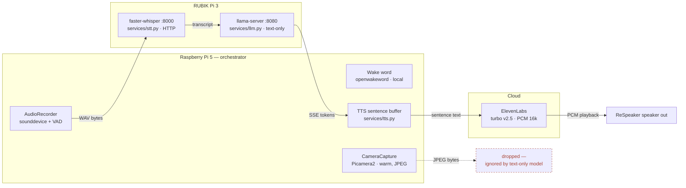
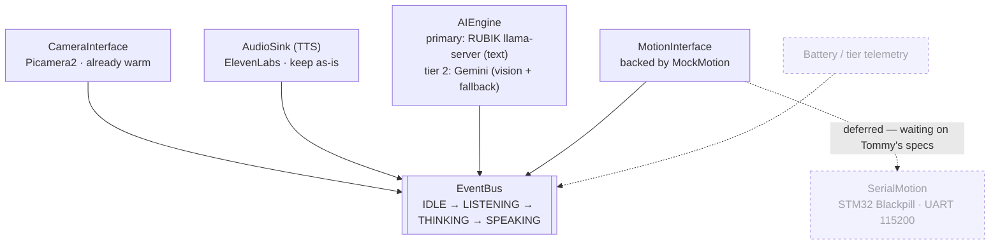
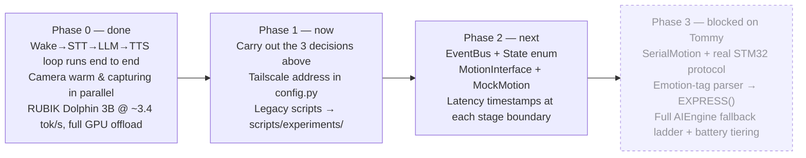

# TODO

Scope-alignment follow-ups agreed 2026-09-08.
Full reasoning and reality-check detail: `.lavish/robot-scope-plan.html`.

## Current state (reality check)

What's actually wired today — the camera and mic still capture in parallel as
designed, but the JPEG has nowhere to go once it's captured.

## Decisions to carry out

- [ ] **STT → Pi 5.** Benchmark first, then swap.
  - [ ] Write a standalone script (not `main.py`) that runs the existing
        wake-word loop and a local `faster-whisper` instance in the same
        process, side by side.
  - [ ] Say the wake word 10–15 times while it transcribes a held buffer in
        the background. Watch for the "Audio buffer overflow" warning already
        logged in `hardware/audio.py`, and for any missed or delayed
        wake-word trigger.
  - [ ] Clean run → swap `services/stt.py`'s HTTP call for the local
        `WhisperModel`, behind the same function signature, so `main.py`
        doesn't change. Start with `tiny.en`.
  - [ ] Contention → keep STT remote on RUBIK; revisit once Phase 2's latency
        instrumentation exists.
- [x] **TTS stays ElevenLabs.** Already the case in `services/tts.py` — no
      code change needed.
- [ ] **Vision → Gemini, as AIEngine's second tier.**
  - [ ] Remove the now-dead `image_bytes` parameter from
        `LlamaLLM.stream_response()` in `services/llm.py` — Gemini owns every
        turn that includes an image now, so RUBIK's text-only client has no
        reason to accept it.
  - [ ] Add the routing rule one level up: image present → call Gemini
        multimodal; no image → RUBIK `llama-server` as today.
  - [ ] No local vision model (YOLO or otherwise) on RUBIK for now — it would
        compete with the LLM for the same RAM/GPU budget, and Gemini already
        covers "describe what's in front of you." Local detection is a
        separate, later problem (continuous tracking, not per-query vision).
- [ ] **One RUBIK address.** Point `RUBIKPI_HOST` at the Tailscale address
      instead of a LAN IP. Remove the two stale IPs still sitting in
      `README.md`.
- [ ] **Move, don't delete.** `voice_assistant.py`, `parrot.py`,
      `test_wakeword.py` → `scripts/experiments/`, as their own commit. Keeps
      git history, gets them out of the import path.
- [ ] **`requirements.txt`** should list everything `main.py`'s import tree
      actually needs (`picamera2`; `google-genai` once the Gemini tier lands).

## Target skeleton

The four seams stay; `AIEngine` grows a second tier and `MotionInterface`
ships backed by `MockMotion` so the event bus has somewhere to publish to
before a single wire exists.

> Note: `CameraInterface` and `AudioSink` above are concrete classes today
> (`hardware/camera.py`, `services/tts.py`), not formal interfaces yet.
> Formalizing all four seams as thin `Protocol`/ABC contracts is Phase 2 work.

## Roadmap

## Hardware — sent to Tommy, awaiting reply (2026-09-08)

- Baud rate — confirm 115200 on the STM32 UART.
- Axis / zero convention — which axis is "home," which direction is positive.
- Pose ranges — min/max per axis the servos can safely reach.
- LOOK→pose mapping owner — proposed: software computes the pose (it has the
  camera FOV), motion just executes it. Needs his sign-off.
- Power budget — confirm the 12V/3A USB-C PD draw for RUBIK doesn't starve
  the motion board on shared battery under load.
- Sensors for FAULT — are temp/current sensors phase-2 hardware, or already
  on the board? (informational, not blocking)

## Open questions

- Does Tommy want `MotionInterface`'s pose type to assume a full 6-DOF
  Stewart-platform pose, or a simpler pan/tilt shape for a first pass? Affects
  the `MockMotion` interface written in Phase 2.
